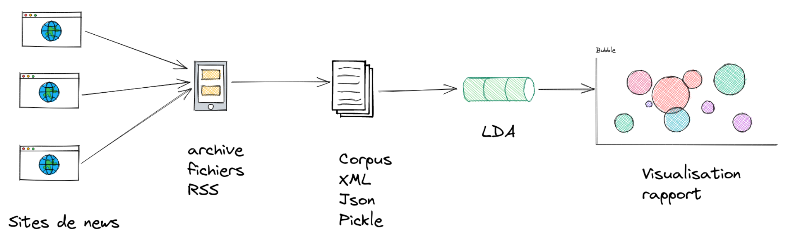

# Manuel d'utilisateur — Projet RSS Topic Modeling

## I. Présentation du projet

### 1. Que fait ce projet ?

Ce projet permet de :
- lire un ou plusieurs fichiers RSS au format XML 
    - les articles seront représentés par des objets `Article`, contenant les informations suivantes : `id`, `source`, `title`, `description`, `date`, `categories`
- construire un corpus réutilisable (xml, json, pkl) 
- ajouter une analyse linguistique (tokens, lemmes, POS) 
    - après cette étape, chaque objet `Article` contiendra un attribut `analysis`, qui regroupe les annotations linguistiques associées à chaque token.
- lancer un topic modeling avec LDA ou BERTopic 
- exporter un résultat visualisable en HTML

Pipeline complet pour ce projet : RSS XML → construction / filtrage du corpus → analyse linguistique → topic modeling → visualisation HTML
<p align="center">
  
</p>

### 2. Que font les scripts ?
- `rss_reader.py` : lire un fichier_flux_rss.xml
- `rss_parcours.py` : lire un fichier ou un dossier RSS, regrouper les articles, les filtrer et exporter le corpus
- `analyzers.py` : ajouter l’analyse linguistique aux articles avec SpaCy, Stanza ou Trankit
- `datastructures.py` : définir les classes `Article` et `Token`, et gèrer la lecture/écriture des formats XML, JSON et Pickle
- `run_lda.py` & `run_bertopic.py` : implémenter la modélisation thématique

⚠️ vous trouverez dans la fonction `main` de chaque fichier `.py` des exemples de commandes pour exécuter le script

## II. Préparation vos données et 环境设置
1. Ouvrir votre terminal(⚠️activer l'environnement virtuel)
2. Cloner notre repertoitoire et se déplacer dans le projet
    ```
    git clone https://gitlab.com/plurital-ppe2-2026/groupe11/projet.git
    ```
    ```
    cd projet
    ```
3. Préparer votre ficheir ou dossier de flux RSS et le nommer `Corpus` pour vous puissse utiliser directement les commandes suivants
4. Installer les outils : (⚠️ Vous n’avez besoin d’installer que l’outil d’analyse que vous allez utiliser. Nous recommandons SpaCy)
    - SpaCy : 
    ```
    pip install spacy
    python -m spacy download fr_core_news_sm
    ```
    - Stanza :
    ```
    pip install stanza
    ```
    - Trankit : (il faut python 3.10)
    ```
    uv pip install https://github.com/pmagistry/trankit.git
    ```


## III. Commencez (开始体验 !)

### 1. Lire les flux RSS
Pour vérifier si les articles s'affichent correctement
    ```
    python rss_parcours.py Corpus
    ```
您将会在终端看到`Numéro d'article`, `id`, `source`, `title`, `description`, `date`, `categories`, `analysis`


### 2. Construire un corpus_sérialisé (et filtrer)
- Depuis des fichiers RSS et les sauvegarder sous différents format (`xml`, `json`, `pkl`)
    ```
    python rss_parcours.py Corpus -o corpus.[xml, json, pkl]
    ```
    Exemple :
    ```
    python rss_parcours.py Corpus -o corpus.pkl
    ```
- Avec filtres :
    ```
    python rss_parcours.py chemin_vers_votre_doc -d [date_début] -f [date_fin] -s [liste source] -c [liste catégories] -o corpus_sérialisé.[json, xml, pkl]
    ```
    Exemple :
    ```
    python rss_parcours.py chemin_vers_votre_doc -d 2025-02-01 -s blast -c culture -o corpus_sérialisé.pkl
    ```
- Depuis un corpus_sérialisé déjà existant (vous pouvez aussi filtrer et convertir le format) :
    ```
    python rss_parcours.py corpus_sérialisé.[json, xml, pkl] -d [date_début] -f [date_fin] -s [liste source] -c [liste catégories] -o corpus_filtre.[json, xml, pkl]
    ```
    Exemple :
    ```
    python rss_parcours.py corpus_sérialisé.pkl -d 2025-02-01 -s blast -c culture -o corpus_sérialisé.json
    ```

### 3. Ajouter les tokens (analyse)
    ```
    python analyzers.py corpus_sérialisé.[json, xml, pkl] -a [spacy, stanza, trankit] -o corpus_analysé.[json, xml, pkl]
    ```
    Exemple :
    ```
    python analyzers.py corpus_sérialisé.pkl -a spacy -o corpus_analysé.pkl
    ```

### 4. Topic Modeling et Afficher le résultat sous format HTML (有两种Model可以选择, 您可以两种都体验一下然后选择您的偏好)
#### - LDA 
    ```
    python run_lda.py corpus_sérialisé_analysé.pkl -form [lemma, mot] -pos [ADJ, NOUN, VERB...] -o résultat.html
    ```
    Exemple :
    ```
    python run_lda.py corpus_sérialisé_analysé.pkl -form mot -pos NOUN -o résultat_lda.html
    ```
    ⚠️ Ici, n’uploadez pas des fichiers trop petits, sinon il sera impossible de résumer les topics.
#### - BerTopic
    ```
    python run_bertopic.py corpus_sérialisé_analysé.pkl -form [lemma, mot] -pos [ADJ, NOUN, VERB...] -o résultat.html
    ```
    Exemple :
    ```
    python run_bertopic.py corpus_sérialisé_analysé.pkl -form mot -pos NOUN -o résultat_bertopic.html
    ```


