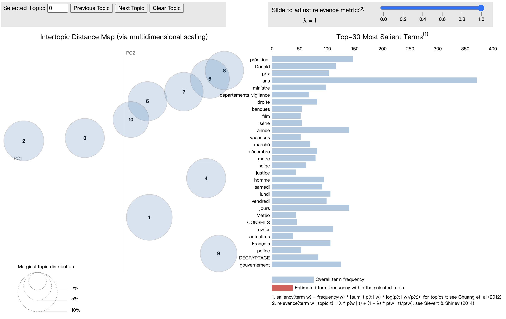
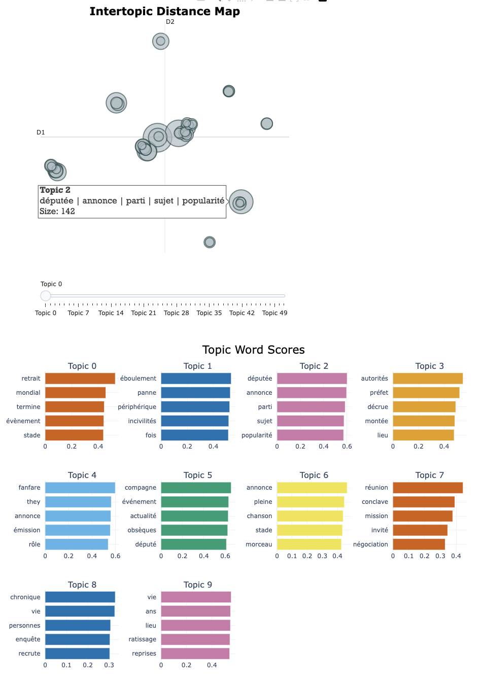

# Manuel d'utilisateur — Projet RSS Topic Modeling

## I. Présentation du projet

### 1. Que fait ce projet ?

Ce projet permet de :
- lire un ou plusieurs fichiers RSS au format XML 
    - les articles seront représentés par des objets `Article`, contenant les informations suivantes : `id`, `source`, `title`, `description`, `date`, `categories`
- construire un corpus réutilisable (xml, json, pkl) 
- ajouter une analyse linguistique (tokens, lemmes, POS) 
    - après cette étape, chaque objet `Article` contiendra un attribut `analysis`, qui regroupe les annotations linguistiques associées à chaque token.
- lancer un topic modeling avec LDA ou BERTopic 
- exporter un résultat visualisable en HTML

Pipeline complet pour ce projet : RSS XML → construction / filtrage du corpus → analyse linguistique → topic modeling → visualisation HTML
<p align="center">
  
</p>

### 2. Que font les scripts ?
- `rss_reader.py` : lire un fichier_flux_rss.xml
- `rss_parcours.py` : lire un fichier ou un dossier RSS, regrouper les articles, les filtrer et exporter le corpus
- `analyzers.py` : ajouter l’analyse linguistique aux articles avec SpaCy, Stanza ou Trankit
- `datastructures.py` : définir les classes `Article` et `Token`, et gèrer la lecture/écriture des formats XML, JSON et Pickle
- `run_lda.py` & `run_bertopic.py` : implémenter la modélisation thématique

⚠️ vous trouverez dans la fonction `main` de chaque fichier `.py` des exemples de commandes pour exécuter le script

## II. Préparations

### 1. Préparations de l'environnement

- Ouvrir votre terminal

- Activer l'environnement virtuel (Si vous n’en avez pas encore, veuillez demander à l'IA de créer et d'activer un environnement virtuel basé sur votre appareil.)

### 2. Mise en place du projet 
Les étapes suivantes doivent être exécutées dans le terminal, à l’intérieur de l’environnement virtuel activé. Il vous suffit de copier-coller les commandes ci-dessous et d’appuyer sur Entrée.

- Cloner notre repertoitoire et se déplacer dans le projet
    ```
    git clone https://gitlab.com/plurital-ppe2-2026/groupe11/projet.git
    ```
    ```
    cd projet
    ```
- Préparer votre fichier RSS ou votre dossier de flux RSS et renommez-le `Corpus`, afin de pouvoir utiliser directement les commandes données dans la suite.

- Installer les outils nécessaires. : (⚠️ Vous n’avez pas besoin d’installer tous les outils : installez seulement le lecteur RSS et l’outil d’analyse linguistique que vous souhaitez utiliser. Nous recommandons `feedparser` pour la lecture RSS et `SpaCy` pour l’analyse linguistique.)
    - RSS Reader
        - `xml` : Aucun paquet supplémentaire n’est nécessaire : ce mode repose sur les bibliothèques standard de Python.
        - `etree` : Aucun paquet supplémentaire n’est nécessaire : ce mode utilise xml.etree.ElementTree, inclus dans la bibliothèque standard de Python.
        - `feedparser` : Ceci est recommandé car `xml` et `etree` ont des limitations dans la lecture de certains fichiers xml.
            ```
            pip install feedparser
            ```
    - Analyseur 
        - `SpaCy` : 
            ```
            pip install spacy
            python -m spacy download fr_core_news_sm
            ```
        - `Stanza` :
            ```
            pip install stanza
            ```
        - `Trankit` : (il faut `python 3.10`)
            ```
            uv pip install https://github.com/pmagistry/trankit.git
            ```


## III. Utilisation du projet pas à pas

### 1. Lire les flux RSS
- Vérifier que les fichiers RSS sont correctement lus et que les articles sont bien extraits
    ```
    python rss_parcours.py Corpus
    ```
Les articles s’affichent dans le terminal avec leurs principales informations : `id`, `source`, `title`, `description`, `date`, `categories` et `analysis`. À ce stade, l’attribut `analysis` est encore vide, car l’analyse linguistique n’a pas encore été appliquée.

Une fois la lecture vérifiée, on peut construire un corpus réutilisable dans un format sérialisé.

### 2. Construire un corpus sérialisé
- Enregistrer les articles extraits dans un format réutilisable (`xml`, `json`, `pkl`)
    ```
    python rss_parcours.py Corpus -o corpus.pkl
    ```
    Un fichier `corpus.pkl` est créé dans `projet`. Il contient l’ensemble des objets Article extraits depuis les flux RSS. Vous pouvez l'enregistrer dans le format souhaité en modifiant l'extension du fichier.
    
    Ce corpus peut ensuite être filtré ou enrichi par une analyse linguistique.


### 3. Filtrer le corpus
- Ne conserver que les articles correspondant à certains critères, par exemple une période, une source ou une catégorie.
    ```
    python rss_parcours.py Corpus -d 2025-02-01 -s blast -c culture -o corpus_filtré.pkl
    ```
    Ou utilisez le corpus que vous venez de sérialiser.
    ```
    python rss_parcours.py corpus.pkl -d 2025-02-01 -s blast -c culture -o corpus_filtré.pkl
    ```
    Un fichier `corpus_filtré.pkl` est créé dans `projet`. Il contient uniquement les articles correspondant aux filtres indiqués.
    
    Ce corpus filtré servira d’entrée pour l’analyse linguistique.

### 4. Ajouter l’analyse linguistique
- Ajouter aux articles un attribut analysis contenant les annotations linguistiques de chaque token.
    ```
    python analyzers.py corpus_filtré.pkl -a spacy -o corpus_analysé.pkl
    ```
    Un fichier `corpus_analysé.pkl` est créé dans `projet`. Chaque objet Article contient désormais un attribut `analysis`, composé de phrases et de tokens annotés (form, lemma, pos).
    
    Ce corpus analysé peut maintenant être utilisé pour la modélisation thématique.

### 5. Lancer le topic modeling
Vous pouvez utiliser soit LDA, soit BERTopic.

#### - LDA 
```
python run_lda.py corpus_sérialisé_analysé.pkl -form mot -pos NOUN -o résultat_lda.html
```
Un fichier `résultat_lda.html` est créé dans `projet`. Il permet de visualiser les topics extraits du corpus.
    
⚠️ Ici, n’uploadez pas des fichiers trop petits, sinon il sera impossible de résumer les topics.
    
#### - BerTopic
```
python run_bertopic.py corpus_sérialisé_analysé.pkl -form mot -pos NOUN -o résultat_bertopic.html
```
Un fichier `résultat_bertopic.html` est créé dans `projet`. Il contient les visualisations produites par BERTopic.
    
Dans les deux cas, il suffit ensuite d’ouvrir le fichier HTML dans un navigateur.
    
### 6. La visualisation des deux models
Les fichiers HTML générés permettent d’explorer les thèmes détectés dans le corpus.  
L’objectif n’est pas d’obtenir une vérité absolue, mais d’identifier les grandes tendances du corpus et les mots qui caractérisent chaque thème.

#### - LDA
<p align="center">
    
</p>

- le cercle de gauche représente les différents topics ;
- plus un cercle est grand, plus le topic est important dans le corpus ;
- plus deux cercles sont éloignés, plus les topics sont différents ;
- à droite, on voit les mots les plus représentatifs du topic sélectionné.

#### - BerTopic
<p align="center">
    
</p>

- chaque cercle représente un topic ;
- plus un cercle est grand, plus ce topic est présent dans le corpus ;
- plus deux cercles sont éloignés, plus les topics sont différents.
- En dessous, les graphiques en barres montrent les mots les plus représentatifs de chaque topic.


